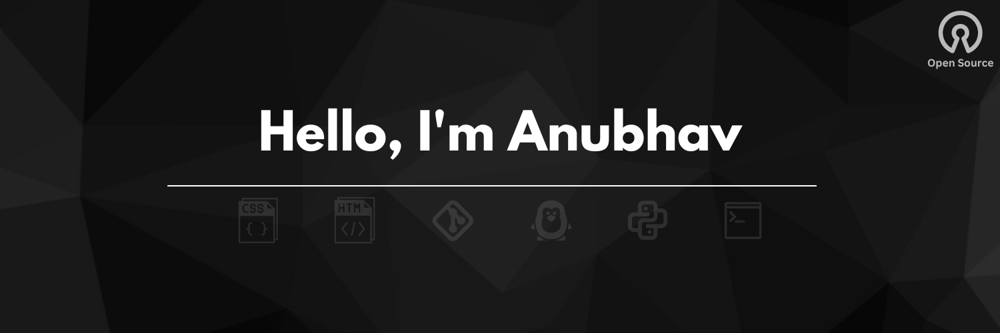

 

Intrested in <b>Cloud-Native Technolgies</b>. Currently learning <b> Web Dev</b>, focusing on <b>backend</b> & <b>DevOps</b> practices. <b>Open source</b> Enthusiast. Continuously learning and engaging with the tech community.
  

<h3 align="left">Skillset:</h3>

<!-- My Skills -->

